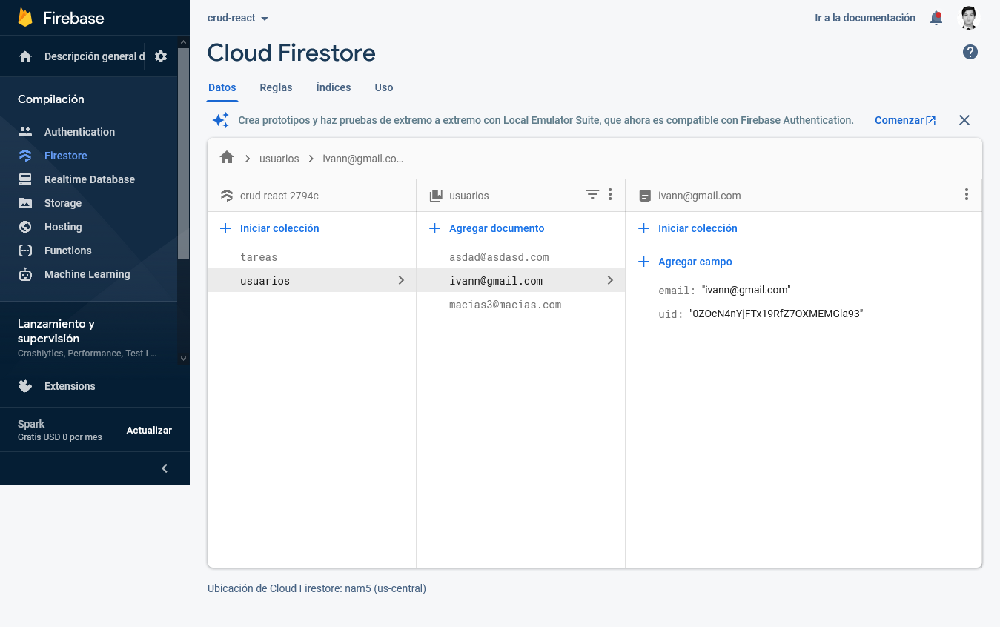

 **Login con React y Firebase**

## Descripción.
Se realizo un Single Page Aplication donde puedes crear cuenta y logiarte para entrar a una ruta protegida con middlewere.

*- Interfaz Principal*.

- Firebase.

 Se creo una base de datos llamada **usuarios** donde se almacena el correo y la contraseña encriptada.
 

Hosting:

https://login-react-74c0a.web.app/login

Dependencias usadas.

    npm i firebase
